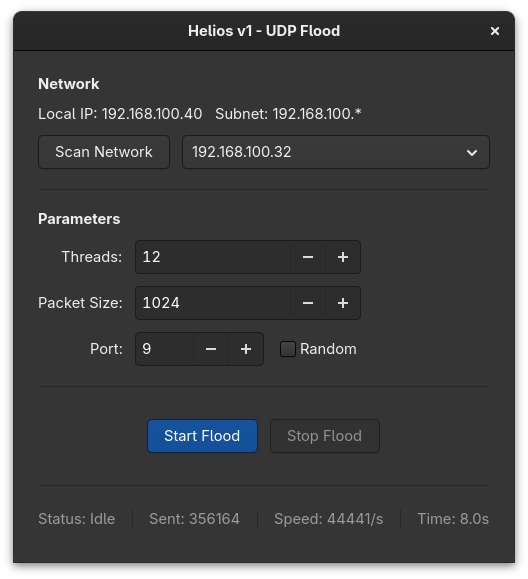

<div align="center">


**A Modern, Lightweight UDP Flood Tool for Linux**

[](https://www.rust-lang.org/)
[](https://www.gtk.org/)
[](LICENSE)
[]()

</div>

---

**Helios** is a high-performance, open-source UDP packet generation and network testing tool built with **Rust** and the **GTK4** framework (via Relm4). Designed for Linux, it offers a seamless, beautiful, and native experience for testing your network infrastructure.

With a focus on speed, aesthetics, and usability, Helios integrates perfectly with modern Linux desktop environments thanks to **Libadwaita**.

<div align="center">
  
</div>

## Features

- **Modern Native UI**: Built with GTK4 and Libadwaita for a sleek, responsive, and native Linux feel.
- **Auto-Discovery**: Built-in simple network scanning to easily identify devices on your local subnet.
- **Multithreaded Performance**: Fully utilizing the blazing speed of Rust with configurable threat limits for maximum throughput.
- **Configurable Payloads**: Easily adjust target ports and packet sizes to fit your testing needs.
- **Live Statistics**: Real-time monitoring of packets sent, packet speed (PPS), and total elapsed time.
- **Randomized Ports**: Option to randomize the source and destination ports dynamically during the flood.

> [!WARNING]
> Helios is a network stress-testing tool. Use ONLY on devices and networks you own or have explicit permission to test. Check local laws before performing network stress tests.

## Usage

Helios can be compiled individually or distributed as an **AppImage**.

### Quick Start

1. **Download** the latest `Helios-x86_64.AppImage` from the [Releases](https://github.com/vdkvdev/Helios/releases) page. *(Assume this link exists when built)*
2. **Make it executable**:
   Open your terminal and run:
   ```bash
   chmod +x Helios-x86_64.AppImage
   ```
3. **Run**:
   ```bash
   ./Helios-x86_64.AppImage
   ```
   *Or simply double-click the file.*

## License

Distributed under the **GPL-3.0 License**. See [LICENSE](LICENSE) for more information.

---

<div align="center">
  Created in 🇨🇱 by <a href="https://github.com/vdkvdev">vdkvdev</a>
</div>
